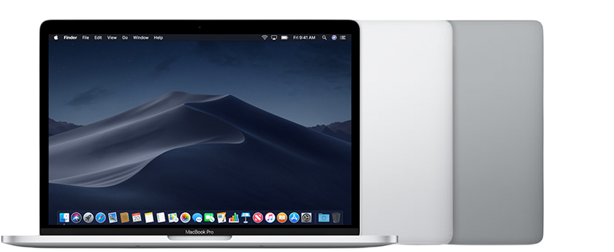
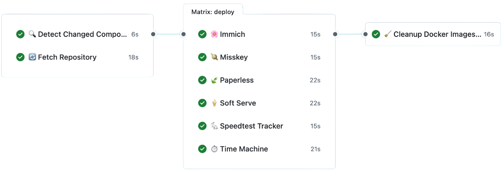

# 💾 コンパクト自宅サーバーのすすめ

<!--
_header: ""
_footer: Souma (@5ouma)
_paginate: false
-->

<!--
コンパクト自宅サーバーのすすめというタイトルでお話しさせていただきます。
-->

## 🏠 自宅サーバーやってますか？

<!--
_footer: ""
_paginate: false
-->

<!--
突然ですが、みなさん自宅サーバーやってますか？
-->

### 🏢 ~~逸般の誤家庭~~ 一般のご家庭

<!-- footer: 🏠 自宅サーバーやってますか？ -->

<div class="columns">


業務用のサーバーを自宅に置く人もいるらしい (?)

</div>

<!--
世の中には、逸脱した誤った家庭と書いて「いっぱんのごかてい」と読まれる人たちが居ます。
業務で用いるような機材をオークションで落札して、本格運用する人たちを指す言葉です。
今回は"general household"の方の「いっぱんのごかてい」についてです。
-->

### 💡 Concept

<div class="columns">


<small>昔使っていたMacBook Proを採用</small>

- シンプル
- コンパクト
- 静音
- 省電力
- 低コスト

</div>

<!--
コンセプトは…です。

お古のMacBookを使って運用しています。
バッテリーのついているラップトップは若干怖いので、リプレースしたいです。
-->

### 🎯 Purpose

- サーバーレスで動かないサービスの構築・運用
  - エッジサーバーも併用
    - ![Cloudflare Workers logo] **[Cloudflare Workers]**
    - ![Deno Deploy logo] **[Deno Deploy]**
- ネットワークの勉強
- Linuxの勉強

[Cloudflare Workers]: https://workers.cloudflare.com
[Cloudflare Workers logo]: https://workers.cloudflare.com/logo.svg
[Deno Deploy]: https://deno.com/deploy
[Deno Deploy logo]: https://github.com/denoland.png

<!--
目的は…です。

個人サイト等はCloudflare WorkersやDeno Deployにホストしています。
ただ、データベースを使ったり、常に起動しておく必要のあるサービスは、なかなかエッジサーバーでは運用できません。
そのため、自宅サーバーと使い分けています。

他にも…といった理由があります。
-->

## 🚀 What/How am I hosting?

<!--
_footer: ""
_paginate: false
-->

<!--
実際に何をどのようにホストしているかについてお話しします。
-->

### 📲 Applications

<!-- footer: 🚀 What/How am I hosting? -->

- ![Misskey logo] **[Misskey]**: ActivityPub互換SNS
- ![Immich logo] **[Immich]**: 写真管理・共有
- ![Paperless logo] **[Paperless]**: 文書管理
- ![Time Machine logo] [Time Machine]用[Samba]サーバー
- その他

[Misskey]: https://misskey-hub.net
[Misskey logo]: https://assets.misskey-hub.net/public/icon.png
[Immich]: https://immich.app
[Immich logo]: https://immich.app/img/immich-logo.svg
[Paperless]: https://paperless-ngx.com
[Paperless logo]: https://raw.githubusercontent.com/paperless-ngx/paperless-ngx/main/src-ui/src/assets/logo-notext.svg
[Time Machine]: https://support.apple.com/104984
[Time Machine logo]: ./images/time-machine.png
[Samba]: https://github.com/mbentley/docker-timemachine

<!--
MisskeyはMastodonよりも機能が豊富で、日本人によって開発されています。
Twitter騒動の時に話題になりましたが、自分でサーバーを立てることが可能です。

ImmichはGoogle Photosの代替というと分かりやすいと思います。
-->

### 🏗️ Infrastructure as Code

<div class="columns">

<div>

![Docker Compose logo] **[Docker Compose]**

- 再現性の確保
- 環境構築の簡素化
- 設定のバージョン管理

</div>

<div>

コマンド1つで起動可能

```sh
docker compose up -d
```

</div>

</div>

[Docker Compose]: https://docs.docker.com/compose
[Docker Compose logo]: https://raw.githubusercontent.com/docker/compose/main/logo.png

<!--
IaCはDocker Composeを使っています。
…のようなメリットがあります。

リモートもTerraformで構築できるようにしたいです。
-->

### 🔐 Security

<div class="columns">

<div>

![Cloudflare logo] **[Cloudflare Tunnel]**

- ポート開放不要
- DDoS対策
- SSL/TLS自動化

</div>

<div>

![Cloudflare logo] **[Cloudflare Access]**

- 多様な認証方法
- アプリケーション側の認証機能不要
- トークンベース認証

</div>

</div>

[Cloudflare Tunnel]: https://developers.cloudflare.com/cloudflare-one/connections/connect-networks
[Cloudflare Access]: https://www.cloudflare.com/zero-trust/products/access
[Cloudflare logo]: https://www.svgrepo.com/show/353564/cloudflare.svg
<!--
セキュリティー周りはCloudflareという巨人の肩に乗っかりましょう。

…

リクエストヘッダーにトークンを付けることで、スマホのアプリからでもバイパスしてアクセスすることができます。
-->

### 💽 Backup Strategy

![offen logo] **[offen/docker-volume-backup]**

- cronによる自動バックアップ
- GPGによる暗号化
- ローカル & ![Cloudflare logo] [Cloudflare R2]
- 自動prune
- 多様なバックアップ失敗通知

[offen/docker-volume-backup]: https://github.com/offen/docker-volume-backup
[offen logo]: https://offen.github.io/press-kit/avatars/avatar-OS-header.svg
[Cloudflare R2]: https://www.cloudflare.com/developer-platform/products/r2

<!--
…

一定の期間外のファイルは自動的に削除してくれます。
何らかの理由でバックアップが失敗しても、通知してくれるので安心です。

MisskeyのファイルはR2に保存しているので、バックアップの必要はありません。
-->

### 📊 Monitoring & Operations

<div class="columns">

<div>

![UptimeRobot logo] **[UptimeRobot]**

- 外形監視
- ダウン通知

</div>

<div>

![New Relic logo] **[New Relic]**

- パフォーマンス監視
- システム不調通知
- ログ分析

</div>

</div>

[UptimeRobot]: https://uptimerobot.com
[UptimeRobot logo]: https://cdn.jsdelivr.net/gh/homarr-labs/dashboard-icons/svg/uptimerobot.svg
[New Relic]: https://newrelic.com
[New Relic logo]: https://companieslogo.com/img/orig/NEWR-973d0528.svg

### 🔄 CI/CD Pipeline

<div class="columns">

<div>

![GitHub Actions logo] **[GitHub Actions]**

- 並列起動テスト
- 並列デプロイ
- ![Tailscale logo] [Tailscale]経由で接続

</div>

<picture>
  <source
    srcset="./images/deploy-light.png"
    media="(prefers-color-scheme: light)"
  />
  <source
    srcset="./images/deploy-dark.png"
    media="(prefers-color-scheme: dark)"
  />
  
</picture>

</div>

[GitHub Actions]: https://github.com/features/actions
[GitHub Actions logo]: https://github.com/actions-user.png
[Tailscale]: https://tailscale.com
[Tailscale logo]: https://github.com/tailscale.png

<!--
並列で実行しているので、ホストするサービスが増えても実行時間は伸びずに済みます。
-->

## 📡 Future Prospects

<!--
footer: ""
_paginate: false
-->

<div class="columns">

<div>

- ミニPCへの移行
  - より柔軟な運用
  - 複数台によるHA構成
- Linux環境の本格運用
  - セットアップの自動化

</div>

<div>

- ![JetKVM logo] [JetKVM]の導入
  インターネットを介した
  - UEFI操作
  - 電源操作
  - OSインストール

</div>

</div>

[JetKVM logo]: https://raw.githubusercontent.com/jetkvm/website/main/public/favicon.png
[JetKVM]: https://jetkvm.com

<!--
今後の展望として、…

中華製ミニPCを安く調達できるので、良い選択肢だと思っています。
IP KVMを使って完全ヘッドレスな環境を構築したいです。
-->

## 🎉 Thank you

<!--
_header: ""
_footer: Souma (@5ouma)
_paginate: false
-->

- Misskey: [**@5ouma@misskey.5ouma.me**](https://misskey.5ouma.me/@5ouma)
- リポジトリ: [**5ouma/homelab**](https://github.com/5ouma/homelab)

<!--
ご清聴ありがとうございました。
話に出たMisskeyのサーバーとGitHubのリポジトリは以下です。
-->
